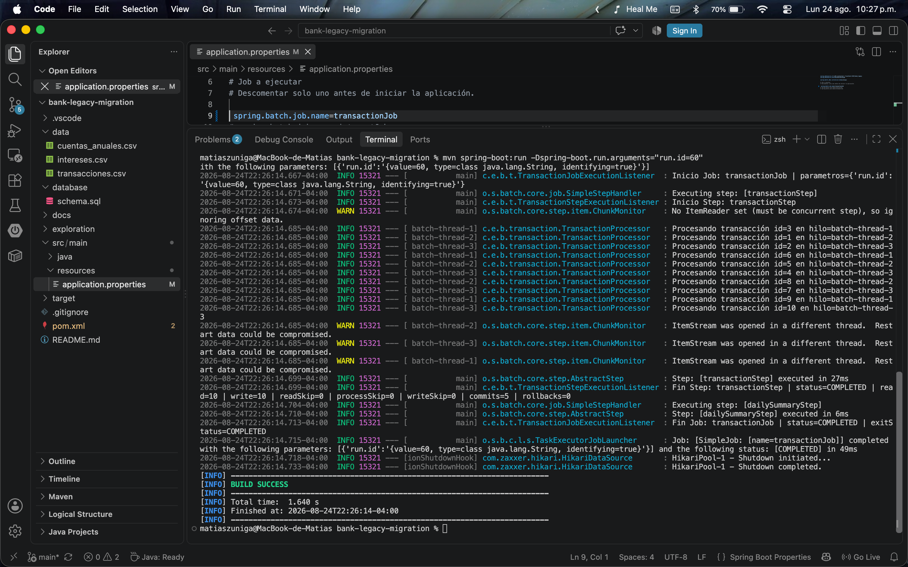

# Bank Legacy Migration - Semana 2

Proyecto desarrollado con **Java, Spring Boot, Spring Batch y PostgreSQL** para procesar información proveniente de archivos CSV de un sistema bancario legacy.

Esta versión corresponde a la continuidad del proyecto desarrollado en Semana 1 e incorpora mejoras orientadas a:

- tolerancia a fallos;
- validación controlada de registros;
- políticas de `skip` y `retry`;
- excepciones personalizadas;
- listeners y trazabilidad;
- procesamiento por chunks;
- ejecución paralela mediante múltiples hilos.

La actividad de Semana 2 solicita mantener los tres procesos batch y agregar políticas de tolerancia a fallos y escalamiento con **3 hilos de ejecución paralela y chunks de tamaño 5**. :contentReference[oaicite:0]{index=0}

---

## Tecnologías utilizadas

- Java 17
- Spring Boot 3
- Spring Batch
- PostgreSQL
- Maven
- Git / GitHub

---

## Estructura general

```text
bank-legacy-migration/
├── data/
│   ├── transacciones.csv
│   ├── intereses.csv
│   └── cuentas_anuales.csv
│
├── database/
│   └── schema.sql
│
├── docs/
│   └── evidencias/
│       ├── transaction-job.png
│       ├── transaction-skip.png
│       ├── interest-job.png
│       └── statement-job.png
│
├── src/main/java/com/example/banklegacymigration/
│   ├── config/
│   ├── transaction/
│   ├── interest/
│   └── statement/
│
├── src/main/resources/
│   └── application.properties
│
├── pom.xml
└── README.md
```

Cada proceso mantiene la arquitectura:

```text
Reader → Processor → Writer
```

y agrega componentes de resiliencia y seguimiento:

```text
Reader
  ↓
Processor
  ├── validación
  ├── transformación
  └── excepciones personalizadas
  ↓
Writer
  ↓
PostgreSQL

+ Skip
+ Retry
+ Listeners
+ Logs
+ Chunk(5)
+ TaskExecutor
```

---

## Procesos implementados

### Transaction Job

Procesa:

```text
data/transacciones.csv
```

El Job:

- valida identificadores y tipos de transacción;
- conserva montos negativos o iguales a cero como anomalías procesables;
- omite registros inválidos mediante excepciones específicas;
- persiste las transacciones válidas;
- genera un resumen diario mediante `dailySummaryStep`.

Flujo:

```text
transactionStep
      ↓
dailySummaryStep
```

---

### Interest Job

Procesa:

```text
data/intereses.csv
```

Calcula intereses y saldo final para cuentas de ahorro y préstamos.

Tasas utilizadas:

- ahorro: 1%;
- préstamo: 2%.

Los tipos de cuenta conocidos pero no contemplados para cálculo, como `hipoteca`, se conservan como anomalías.

También se incorporan validaciones, excepciones personalizadas, listeners y procesamiento paralelo.

---

### Statement Job

Procesa:

```text
data/cuentas_anuales.csv
```

Clasifica los movimientos como:

```text
INGRESO
EGRESO
SIN_MOVIMIENTO
```

y genera posteriormente un resumen anual por cuenta mediante:

```text
statementStep
      ↓
annualSummaryStep
```

El resumen incluye:

- cantidad de movimientos;
- total de ingresos;
- total de egresos;
- saldo neto;
- cantidad de anomalías.

---

## Deuda técnica y correcciones de Semana 1

Antes de implementar las funcionalidades de Semana 2 se corrigieron inconsistencias detectadas en la entrega anterior.

### Consistencia entre modelo y esquema

Se alinearon las columnas utilizadas por los Writers con `database/schema.sql`, incorporando campos faltantes como:

```text
edad
descripcion
```

### Restricciones de unicidad

Se revisaron las restricciones utilizadas por:

```sql
ON CONFLICT
```

para que coincidan con claves primarias o restricciones `UNIQUE` reales en PostgreSQL.

Esto permite mantener la estrategia de persistencia idempotente sin producir conflictos inválidos.

### Finalización de Tasklets

Los tasklets de resumen ahora finalizan explícitamente con:

```java
RepeatStatus.FINISHED
```

en lugar de retornar `null`.

---

## Manejo de errores y excepciones

Semana 1 utilizaba una política general:

```java
.skip(Exception.class)
```

En Semana 2 se reemplazó por políticas específicas.

Se distinguen tres situaciones principales:

```text
Anomalía procesable
→ se conserva y marca

Dato inválido
→ SKIP

Error transitorio de infraestructura
→ RETRY
```

### Excepciones personalizadas

Cada dominio posee una excepción propia de validación, por ejemplo:

```text
InvalidTransactionException
InvalidInterestAccountException
InvalidStatementException
```

Esto permite distinguir errores de negocio de otros errores inesperados.

### Skip

Se utilizan omisiones controladas para errores identificables, como:

- registros inválidos;
- errores de parsing;
- formatos incompatibles.

Ejemplo:

```java
.skip(InvalidTransactionException.class)
.skip(FlatFileParseException.class)
.skipLimit(10)
```

### Retry

Los errores transitorios de persistencia pueden reintentarse:

```java
.retry(TransientDataAccessException.class)
.retryLimit(3)
```

De esta manera, los errores permanentes del dato no son tratados igual que problemas potencialmente temporales de infraestructura.

La pauta evalúa explícitamente políticas de finalización, re-ejecución, reintentos, omisiones y manejo de errores mediante listeners. :contentReference[oaicite:1]{index=1}

---

## Listeners y trazabilidad

Cada Job incorpora listeners para registrar diferentes niveles del procesamiento.

### JobExecutionListener

Registra:

```text
inicio del Job
parámetros
estado final
exit status
```

### StepExecutionListener

Registra métricas como:

```text
read
write
readSkip
processSkip
writeSkip
commits
rollbacks
```

### SkipListener

Registra información de los registros omitidos y el motivo del rechazo.

Ejemplo:

```text
id
tipo
monto
fase del procesamiento
motivo
```

La pauta también considera explícitamente el uso de logs para evaluar el rendimiento y estabilidad del entorno batch. :contentReference[oaicite:2]{index=2}

---

## Procesamiento paralelo

Los Steps principales utilizan:

```java
chunk(5)
```

y un `ThreadPoolTaskExecutor` configurado con:

```text
corePoolSize = 3
maxPoolSize  = 3
```

De esta forma, los registros pueden ser procesados utilizando:

```text
batch-thread-1
batch-thread-2
batch-thread-3
```

El `TaskExecutor` es compartido por los tres procesos.

Los Readers utilizan `SynchronizedItemStreamReader` para sincronizar el acceso al archivo durante la ejecución concurrente.

Además, se utiliza:

```java
saveState(false)
```

privilegiando la reejecución completa e idempotente del archivo frente a la recuperación desde un offset intermedio.

---

## Persistencia e idempotencia

Los resultados son almacenados en PostgreSQL.

Las tablas de detalle utilizan restricciones relacionales junto con:

```sql
ON CONFLICT (...) DO NOTHING
```

para evitar duplicados.

Las tablas derivadas utilizan:

```sql
ON CONFLICT (...) DO UPDATE
```

permitiendo recalcular los resúmenes.

No se utilizan mecanismos adicionales de hashing o deduplicación.

---

## Configuración de PostgreSQL

Crear la base de datos:

```bash
createdb bank_legacy
```

Crear las tablas:

```bash
psql bank_legacy < database/schema.sql
```

La conexión se encuentra en:

```text
src/main/resources/application.properties
```

Spring Batch inicializa además sus tablas de metadatos mediante:

```properties
spring.batch.jdbc.initialize-schema=always
```

---

## Ejecución

Antes de ejecutar se debe descomentar únicamente el Job requerido:

```properties
# spring.batch.job.name=transactionJob
# spring.batch.job.name=interestJob
# spring.batch.job.name=statementJob
```

Por ejemplo:

```properties
spring.batch.job.name=transactionJob
```

Luego:

```bash
mvn spring-boot:run -Dspring-boot.run.arguments="run.id=60"
```

El parámetro `run.id` permite ejecutar una nueva instancia del Job.

---

## Evidencias

Las evidencias se encuentran en:

```text
docs/evidencias/
```

### Transaction Job

Ejecución normal utilizando chunks y tres hilos:


### Transaction - tolerancia a fallos

Se modificó temporalmente un registro para utilizar el tipo:

```text
transferencia
```

El `TransactionProcessor` genera una excepción personalizada, el registro es omitido mediante `skip`, el `SkipListener` registra el motivo y el Job continúa hasta finalizar correctamente.



### Interest Job


### Statement Job


Las ejecuciones muestran procesamiento concurrente mediante:

```text
batch-thread-1
batch-thread-2
batch-thread-3
```

junto con métricas de lectura, escritura, skips, commits y rollbacks.

---

## Resultado

La versión de Semana 2 mantiene los tres procesos batch desarrollados previamente e incorpora mecanismos de resiliencia, seguimiento y escalamiento.

Se implementaron:

```text
✓ chunks de tamaño 5
✓ 3 hilos paralelos
✓ excepciones personalizadas
✓ skip específico
✓ retry para errores transitorios
✓ SkipListener
✓ StepExecutionListener
✓ JobExecutionListener
✓ logs y métricas
✓ Readers sincronizados
✓ persistencia idempotente
```